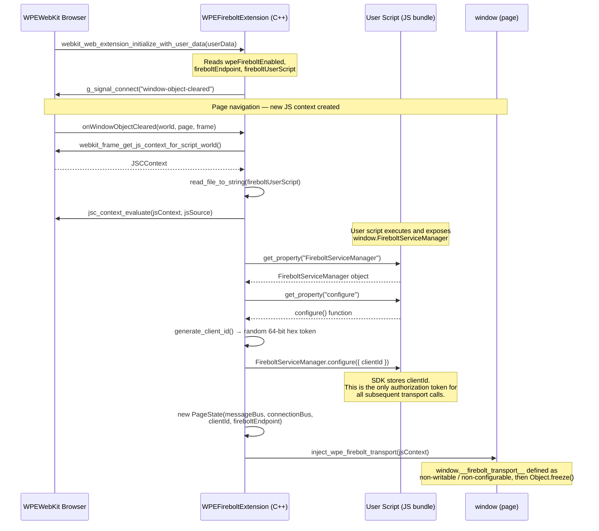
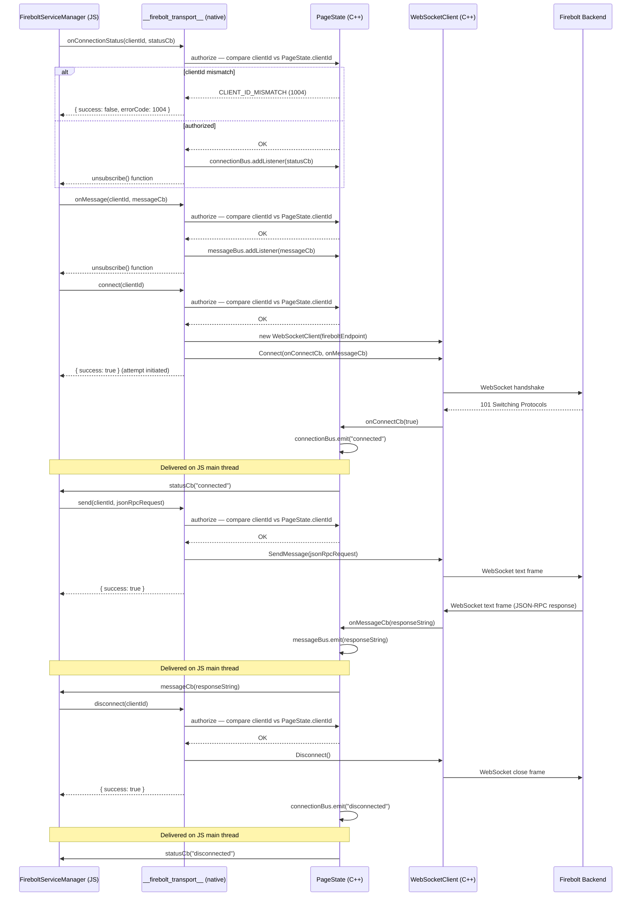

# `window.__firebolt_transport__`

## Overview

`window.__firebolt_transport__` is a **frozen, read-only** native object injected into the main frame's JavaScript context by the WPE Firebolt web extension. It provides a low-level transport bridge between a web application and the Firebolt backend service over a WebSocket connection.

The object is defined as **non-writable** and **non-configurable** — any attempt to reassign or delete `window.__firebolt_transport__` from JavaScript will silently fail (or throw in strict mode).

---

## Lifecycle & Authorization

Before `window.__firebolt_transport__` is available, the extension:

1. Loads and evaluates the user script configured via `fireboltUserScript`.
2. Expects the script to expose a global `window.FireboltServiceManager` object with a `configure(config)` method.
3. Calls `FireboltServiceManager.configure({ clientId })` with a randomly generated 64-bit hex `clientId`.
4. Injects `window.__firebolt_transport__` into the page.

**Every method on `window.__firebolt_transport__` requires the `clientId` as its first argument.** This acts as a per-page security token that prevents unauthorized scripts from using the transport. The `clientId` is only known to the code path that received it via `FireboltServiceManager.configure`.

---

## Return Type

All methods return a `FireboltTransportResult` object:

```ts
{
  success: boolean;
  errorCode?: number; // present only when success === false
}
```

### Error Codes

| Code | Name                       | Description                                              |
|------|----------------------------|----------------------------------------------------------|
| 1001 | `PAGE_STATE_UNAVAILABLE`   | The native page-state object has not been initialised.   |
| 1002 | `INVALID_PARAMETERS`       | Required parameters are missing or of the wrong type.    |
| 1003 | `PAGE_STATE_CLIENT_ID_MISSING` | The `clientId` argument could not be read.           |
| 1004 | `CLIENT_ID_MISMATCH`       | The supplied `clientId` does not match the page token.   |

---

## Methods

### `connect(clientId)`

Opens a WebSocket connection to the Firebolt endpoint that was configured at extension initialisation time.

**Signature**
```ts
connect(clientId: string): FireboltTransportResult
```

**Parameters**

| Name       | Type     | Description                              |
|------------|----------|------------------------------------------|
| `clientId` | `string` | The token received in `FireboltServiceManager.configure`. |

**Behaviour**
- If the transport is already connected the call is a no-op (returns success without reconnecting).
- The actual WebSocket connection is asynchronous. A successful return from `connect()` means the connection attempt was **initiated**, not necessarily established. Use `onConnectionStatus` to be notified when the connection is ready.

**Returns** `{ success: true }` when the connection attempt was started, or `{ success: false, errorCode }` on authorisation failure.

---

### `disconnect(clientId)`

Closes the active WebSocket connection.

**Signature**
```ts
disconnect(clientId: string): FireboltTransportResult
```

**Parameters**

| Name       | Type     | Description                              |
|------------|----------|------------------------------------------|
| `clientId` | `string` | The token received in `FireboltServiceManager.configure`. |

**Behaviour**
- If no connection is open the call is a safe no-op.
- After disconnect, `send()` will not deliver messages.

**Returns** `{ success: true }` on success, or `{ success: false, errorCode }` on authorisation failure.

---

### `send(clientId, message)`

Sends a text message over the active WebSocket connection.

**Signature**
```ts
send(clientId: string, message: string): FireboltTransportResult
```

**Parameters**

| Name       | Type     | Description                                                   |
|------------|----------|---------------------------------------------------------------|
| `clientId` | `string` | The token received in `FireboltServiceManager.configure`.     |
| `message`  | `string` | The message payload to send (typically a JSON-RPC string).    |

**Behaviour**
- The message is dropped silently if the transport is not connected.

**Returns** `{ success: true }` when the message was passed to the WebSocket layer, or `{ success: false, errorCode }` on authorisation failure.

---

### `onConnectionStatus(clientId, callback)`

Subscribes to WebSocket connection-state change events.

**Signature**
```ts
onConnectionStatus(
  clientId: string,
  callback: (status: string) => void
): () => FireboltTransportResult
```

**Parameters**

| Name       | Type                          | Description                                                       |
|------------|-------------------------------|-------------------------------------------------------------------|
| `clientId` | `string`                      | The token received in `FireboltServiceManager.configure`.         |
| `callback` | `(status: string) => void`    | Invoked on the JS main thread whenever the connection state changes. The `status` string is `"connected"` when connected and `"disconnected"` when disconnected. |

**Returns** An **unsubscribe function**. Call it to stop receiving events:
```js
const off = transport.onConnectionStatus(clientId, cb);
// later…
off(); // { success: true }
```

---

### `onMessage(clientId, callback)`

Subscribes to incoming WebSocket messages from the Firebolt backend.

**Signature**
```ts
onMessage(
  clientId: string,
  callback: (message: string) => void
): () => FireboltTransportResult
```

**Parameters**

| Name       | Type                          | Description                                                                  |
|------------|-------------------------------|------------------------------------------------------------------------------|
| `clientId` | `string`                      | The token received in `FireboltServiceManager.configure`.                    |
| `callback` | `(message: string) => void`   | Invoked on the JS main thread for each message received from the backend. `message` is the raw text frame (typically a JSON-RPC response). |

**Returns** An **unsubscribe function**. Call it to stop receiving messages:
```js
const off = transport.onMessage(clientId, cb);
// later…
off(); // { success: true }
```

---

## Call Flow Diagrams

### Diagram 1 — Transport Injection & `FireboltServiceManager` Configuration

Shows how the native extension bootstraps the page: evaluating the user script, handing the `clientId` to `FireboltServiceManager`, creating the `PageState`, and finally freezing `window.__firebolt_transport__` on the page.



---

### Diagram 2 — Connect, Send, Receive & Disconnect

Shows how `FireboltServiceManager` (holding the `clientId`) uses the transport to open a WebSocket connection, exchange JSON-RPC messages with the Firebolt backend, and cleanly disconnect. Every call is authorized by matching the supplied `clientId` against `PageState`.



---

## Usage Examples

### a. Connect and register for connection status

```js
const transport = window.__firebolt_transport__;

// clientId is provided by FireboltServiceManager.configure()
let myClientId; // set by your SDK from the configure() call

// 1. Subscribe to connection status BEFORE calling connect
const offConnStatus = transport.onConnectionStatus(myClientId, (status) => {
    const connected = status === 'connected';
    console.log('Firebolt transport connected:', connected);

    if (!connected) {
        console.warn('Transport disconnected, consider retrying connect()');
    }
});

// 2. Initiate the connection
const connectResult = transport.connect(myClientId);
if (!connectResult.success) {
    console.error('connect() failed with errorCode:', connectResult.errorCode);
}
```

---

### b. Send and receive messages

```js
// Subscribe to incoming messages
const offMessage = transport.onMessage(myClientId, (message) => {
    const response = JSON.parse(message);
    console.log('Received Firebolt response:', response);
    // dispatch response.id to the waiting promise, etc.
});

// Send a JSON-RPC request
function callFirebolt(id, method, params) {
    const request = JSON.stringify({ jsonrpc: '2.0', id, method, params });
    const result = transport.send(myClientId, request);
    if (!result.success) {
        console.error('send() failed with errorCode:', result.errorCode);
    }
}

callFirebolt(1, 'device.id', {});
```

---

### c. Disconnect

```js
// Tear down subscriptions first, then disconnect
offMessage();
offConnStatus();

const result = transport.disconnect(myClientId);
if (!result.success) {
    console.error('disconnect() failed with errorCode:', result.errorCode);
}
```

---

## Notes

- All callbacks are **dispatched on the JavaScript main thread** via the GLib main context, so it is safe to update UI or call other JS APIs from within them.
- Multiple independent subscribers can be registered for both `onConnectionStatus` and `onMessage`; each receives its own numeric listener ID and is removed independently by its unsubscribe function.
- The object is **frozen** (`Object.freeze`) after injection; adding properties to it from JavaScript will silently fail.
